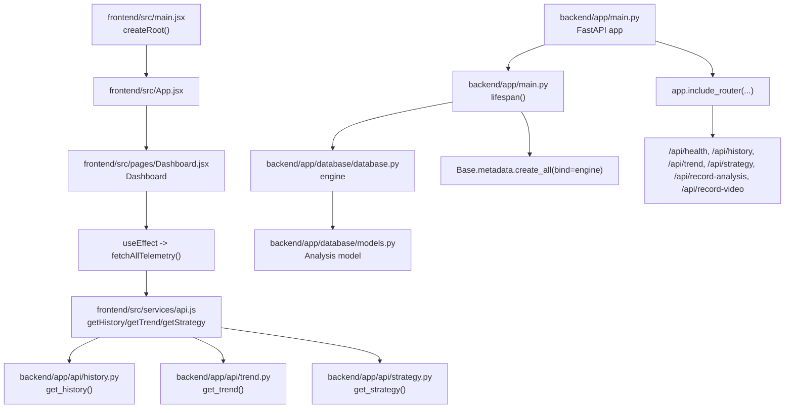
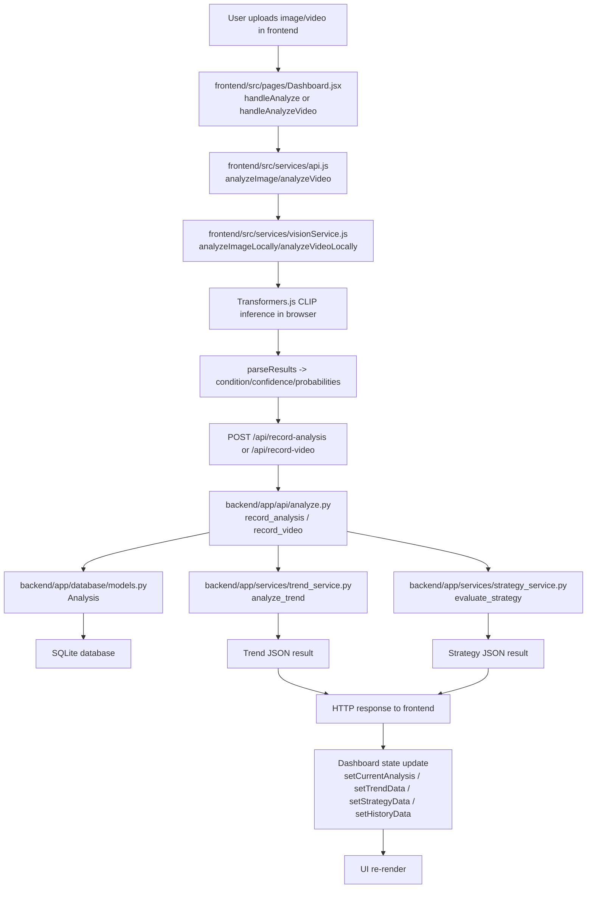

# Application Execution Flow

## 1. Project Overview

- Project purpose: AquaRace AI is a motorsport telemetry/dashboard app that classifies a racing track as Dry, Damp, or Wet from uploaded images or sampled video frames, then provides a trend summary and tire-strategy recommendation.
- Tech stack:
  - Frontend: React 19 + Vite + JavaScript, Tailwind CSS, Axios, React Three Fiber / Three.js, Recharts, GSAP, Lenis.
  - Browser AI: `@huggingface/transformers` with the `Xenova/clip-vit-base-patch32` CLIP model.
  - Backend: Python + FastAPI + Uvicorn + SQLAlchemy + SQLite.
  - Data persistence: SQLite database file created by SQLAlchemy, mapped through the `Analysis` model.
- Architecture type: Full-stack web application with a client-rendered React frontend and a FastAPI JSON API. The image/video classification model runs in the browser; the backend stores results and computes trend/strategy from the saved history.

## 2. Repository Architecture

Important directories and responsibilities:

- `frontend/`: Vite React application and UI.
  - `frontend/src/main.jsx`: frontend bootstrap.
  - `frontend/src/App.jsx`: top-level app wrapper.
  - `frontend/src/pages/Dashboard.jsx`: main dashboard and orchestration logic.
  - `frontend/src/services/api.js`: HTTP + fallback logic for backend APIs.
  - `frontend/src/services/visionService.js`: browser-side CLIP inference and video sampling.
  - `frontend/src/components/`: UI views, uploaders, charts, cards, 3D/parallax effects.
- `backend/`: FastAPI backend.
  - `backend/app/main.py`: backend startup and router registration.
  - `backend/app/api/`: route modules for `/api/health`, `/api/history`, `/api/trend`, `/api/strategy`, and analysis persistence.
  - `backend/app/services/`: trend and strategy business logic.
  - `backend/app/database/`: SQLAlchemy database setup and ORM model.
  - `backend/app/models/`: Pydantic response schemas.
- `public/`: static frontend assets, including landing-page screenshot.
- `data/`: repository data folder; no runtime entry point was found there.
- `scratch/`: local instrument/test scripts for API flow and strategy/trend logic; not part of the production app startup.

## 3. Entry Points

| Context | Entry point file | Purpose |
|---|---|---|
| Frontend bootstrap | `frontend/src/main.jsx` | Creates the React root and renders `<App />` into the DOM. |
| Frontend app shell | `frontend/src/App.jsx` | Renders the dashboard. |
| Dashboard runtime | `frontend/src/pages/Dashboard.jsx` | Orchestrates image/video analysis, telemetry fetches, state updates, and dashboard panels. |
| Frontend API layer | `frontend/src/services/api.js` | Calls backend endpoints and contains local fallback logic when the backend is unavailable. |
| Browser ML inference | `frontend/src/services/visionService.js` | Loads CLIP and runs image/video classification locally in the browser. |
| Backend app | `backend/app/main.py` | Creates the FastAPI app, enables CORS, and registers API routers. |
| Backend DB setup | `backend/app/database/database.py` | Defines the SQLite engine, session factory, and `get_db()` dependency. |
| Analysis persistence | `backend/app/api/analyze.py` | Stores image and video analysis results in SQLite. |
| History API | `backend/app/api/history.py` | Fetches recent analyses from SQLite. |
| Trend API | `backend/app/api/trend.py` | Reads recent history and calls `analyze_trend()`. |
| Strategy API | `backend/app/api/strategy.py` | Reads recent history and calls `evaluate_strategy()`. |

Important note: There is no `if __name__ == "__main__":` block in `backend/app/main.py`. The application is started by an ASGI server such as `uvicorn app.main:app` externally. The repository does not contain a backend CLI entry point beyond the FastAPI app object itself.

## 4. Application Startup Flow

### Startup sequence

1. The frontend starts through `frontend/src/main.jsx`.
2. `createRoot(document.getElementById('root')).render(...)` mounts the React application.
3. `frontend/src/App.jsx` renders `Dashboard`.
4. `frontend/src/pages/Dashboard.jsx` executes `useLenis()`, sets up scroll listeners, initializes empty state, and calls `fetchAllTelemetry()` in a `useEffect`.
5. `fetchAllTelemetry()` calls `getHistory()`, `getTrend()`, and `getStrategy()` from `frontend/src/services/api.js`.
6. The backend startup path is handled separately when the Python API server starts:
   - `backend/app/main.py` defines `lifespan(app)`.
   - Inside `lifespan()`, `Base.metadata.create_all(bind=engine)` executes once during server startup.
   - This creates the SQLite tables defined by `backend/app/database/models.py`.
   - CORS is enabled using `CORSMiddleware`.
   - API routers are included under `/api`.
7. After routers are attached, the app exposes endpoints (`/api/health`, `/api/history`, `/api/trend`, `/api/strategy`, `/api/record-analysis`, `/api/record-video`).

### Startup Mermaid diagram



## 5. Frontend Execution Flow

### Frontend bootstrap

- `frontend/src/main.jsx` is the true browser entry point.
- It imports `App` from `frontend/src/App.jsx` and renders it under `document.getElementById('root')` inside `StrictMode`.

### Root component and dashboard

- `frontend/src/App.jsx` simply renders `<Dashboard />` within a full-height dark background.
- `frontend/src/pages/Dashboard.jsx` is the main stateful frontend control center.
- It holds the major state variables:
  - `currentAnalysis`
  - `historyData`
  - `trendData`
  - `strategyData`
  - `analysisMode`
  - `videoResult`
  - `isAnalyzing`
  - `isAnalyzingVideo`
  - `isDemoMode`
- It registers a scroll listener via `useEffect()` and toggles sticky navigation with `setIsNavSticky()`.

### UI interaction flow

- The user selects the analysis mode in `frontend/src/components/Analysis/AnalysisViewer.jsx`.
- `AnalysisViewer` renders either:
  - `ImageUploader` for image analysis
  - `VideoUploader` for video analysis
- In image mode, `ImageUploader` validates the chosen file and calls `onAnalyze(selectedFile)` when the user clicks the analyze button.
- In video mode, `VideoUploader` validates the chosen file and calls `onAnalyzeVideo(selectedFile)` when the user clicks the analyze button.

### Important handlers

- `Dashboard.handleAnalyze()` in `frontend/src/pages/Dashboard.jsx`
  - sets loading state and inference status
  - if demo mode is enabled, uses local demo data
  - otherwise calls `analyzeImage(file, (msg) => setInferenceStatus(msg))`
  - then updates `currentAnalysis` and refreshes telemetry via `fetchAllTelemetry(result)`
- `Dashboard.handleAnalyzeVideo()` in `frontend/src/pages/Dashboard.jsx`
  - sets loading state and inference status
  - if demo mode is enabled, uses local demo video result
  - otherwise calls `analyzeVideo(file, (msg) => setInferenceStatus(msg))`
  - stores `videoResult`, updates trend/strategy state, and refreshes telemetry

### Browser ML inference path

- `frontend/src/services/api.js` imports `analyzeImageLocally` and `analyzeVideoLocally` from `frontend/src/services/visionService.js`.
- `frontend/src/services/visionService.js` lazy-loads the CLIP pipeline using `pipeline('zero-shot-image-classification', 'Xenova/clip-vit-base-patch32')`.
- `analyzeImageLocally(file, onProgress)` does:
  - `getClassifier(onProgress)`
  - `runClip(objectUrl, classifier)`
  - `parseResults(results, file.name)`
- `analyzeVideoLocally(file, onProgress)` does:
  - creates a hidden HTML video element
  - computes sample timestamps from the video duration
  - seeks to each timestamp
  - captures a frame to a canvas with `captureFrame(videoEl)`
  - runs `runClip(frameDataUrl, classifier)` for each frame
  - applies `stabilizeVideoFrames(frameResults)`
  - returns `filename`, `frames_analyzed`, `frames`, and `condition_sequence`

### Frontend update flow

- `Dashboard` passes `currentAnalysis`, `trendData`, `strategyData`, and `historyData` into UI components such as:
  - `ConditionCard`
  - `TrendSection`
  - `StrategySection`
  - `AnalysisTimeline`
- These components re-render when state changes.

## 6. Backend Execution Flow

### FastAPI app startup

- `backend/app/main.py` creates the `app` object with `FastAPI(...)`.
- The `lifespan` hook runs when the server starts and executes `Base.metadata.create_all(bind=engine)`.
- `app.add_middleware(CORSMiddleware, ...)` adds CORS support.
- `app.include_router(...)` registers four routers:
  - `app.api.analyze.router` under `/api`
  - `app.api.history.router` under `/api`
  - `app.api.trend.router` under `/api`
  - `app.api.strategy.router` under `/api`

### Database initialization

- `backend/app/database/database.py` defines:
  - `SQLALCHEMY_DATABASE_URL = "sqlite:///./aquarace.db"`
  - `engine = create_engine(...)`
  - `SessionLocal = sessionmaker(...)`
  - `Base = declarative_base()`
  - `get_db()` yields a DB session and closes it afterward
- `backend/app/database/models.py` defines the `Analysis` ORM model with columns:
  - `id`
  - `timestamp`
  - `filename`
  - `condition`
  - `confidence`
  - `dry_probability`
  - `damp_probability`
  - `wet_probability`

### Backend request lifecycle

- Requests come in through FastAPI route handlers.
- `Depends(get_db)` resolves a database session for each request.
- Each route reads or writes `Analysis` rows via SQLAlchemy.
- Trend and strategy routes call service functions in `backend/app/services/`.
- Pydantic schemas validate and shape the response payloads.

## 7. Request Lifecycle

### Runtime request flow



## 8. Function Call Hierarchy

```text
Application Entry
└── frontend/src/main.jsx
    └── createRoot(...).render(<App />)
        └── frontend/src/App.jsx
            └── App()
                └── frontend/src/pages/Dashboard.jsx
                    ├── useLenis()
                    ├── fetchAllTelemetry()
                    │   ├── getHistory()
                    │   │   └── GET /api/history
                    │   ├── getTrend()
                    │   │   └── GET /api/trend
                    │   └── getStrategy()
                    │       └── GET /api/strategy
                    ├── handleAnalyze(file)
                    │   └── analyzeImage(file)
                    │       └── analyzeImageLocally(file)
                    │           ├── getClassifier()
                    │           ├── runClip()
                    │           └── parseResults()
                    │               └── POST /api/record-analysis
                    │                   └── backend/app/api/analyze.py
                    │                       └── record_analysis()
                    │                           ├── Analysis(...)
                    │                           ├── db.add(...)
                    │                           ├── db.commit()
                    │                           └── return AnalysisResponse
                    └── handleAnalyzeVideo(file)
                        └── analyzeVideo(file)
                            └── analyzeVideoLocally(file)
                                ├── getClassifier()
                                ├── computeSampleTimestamps()
                                ├── seekTo()
                                ├── captureFrame()
                                ├── runClip()
                                ├── stabilizeVideoFrames()
                                └── POST /api/record-video
                                    └── backend/app/api/analyze.py
                                        └── record_video()
                                            ├── Analysis(...)
                                            ├── db.add(...)
                                            ├── db.commit()
                                            ├── analyze_trend(condition_sequence)
                                            │   └── backend/app/services/trend_service.py
                                            └── evaluate_strategy(latest_condition, latest_trend, condition_sequence)
                                                └── backend/app/services/strategy_service.py
```

## 9. API Execution Flow

### `GET /api/health`

- Entry point: `backend/app/main.py`
- Route: `health_check()`
- Middleware: `CORSMiddleware` from `backend/app/main.py`
- Controller: `backend/app/main.py` `health_check()`
- Service: none
- Database: none
- Response: `{"status": "ok"}`

Call chain:

`frontend/src/services/api.js`
→ `GET /api/health` (not directly used in the main dashboard flow; health endpoint exists for status checks)
→ `backend/app/main.py`
→ `health_check()`
→ HTTP response

### `GET /api/history`

- Entry point: `frontend/src/services/api.js` `getHistory()`
- Route: `backend/app/api/history.py` `get_history()`
- Middleware: `CORSMiddleware`
- Controller: `get_history()`
- Service: none, direct SQLAlchemy query
- Database: `Analysis` table via `db.query(Analysis)`
- Response: list of `AnalysisResponse` rows

Call chain:

`frontend/src/pages/Dashboard.jsx`
→ `fetchAllTelemetry()`
→ `getHistory()`
→ `GET /api/history`
→ `backend/app/api/history.py`
→ `get_history()`
→ `db.query(Analysis).order_by(Analysis.timestamp.desc()).limit(limit).all()`
→ `AnalysisResponse` list
→ `setHistoryData()`
→ UI re-renders

### `GET /api/trend`

- Entry point: `frontend/src/services/api.js` `getTrend()`
- Route: `backend/app/api/trend.py` `get_trend()`
- Middleware: `CORSMiddleware`
- Controller: `get_trend()`
- Service: `backend/app/services/trend_service.py` `analyze_trend()`
- Database: queries the most recent `Analysis` rows
- Response: `TrendResponse`

Call chain:

`frontend/src/pages/Dashboard.jsx`
→ `fetchAllTelemetry()`
→ `getTrend()`
→ `GET /api/trend`
→ `backend/app/api/trend.py`
→ `get_trend()`
→ `db.query(Analysis)...` to fetch recent records
→ `sequence = [record.condition for record in chronological_records]`
→ `analyze_trend(sequence)`
→ `backend/app/services/trend_service.py`
→ `TrendResponse`
→ `setTrendData()`

### `GET /api/strategy`

- Entry point: `frontend/src/services/api.js` `getStrategy()`
- Route: `backend/app/api/strategy.py` `get_strategy()`
- Middleware: `CORSMiddleware`
- Controller: `get_strategy()`
- Service: `backend/app/services/trend_service.py` `analyze_trend()` and `backend/app/services/strategy_service.py` `evaluate_strategy()`
- Database: recent `Analysis` rows
- Response: `StrategyResponse`

Call chain:

`frontend/src/pages/Dashboard.jsx`
→ `fetchAllTelemetry()`
→ `getStrategy()`
→ `GET /api/strategy`
→ `backend/app/api/strategy.py`
→ `get_strategy()`
→ `db.query(Analysis).order_by(...).limit(10).all()`
→ `history_seq = [record.condition ...]`
→ `analyze_trend(history_seq)`
→ `evaluate_strategy(latest_condition, trend_status, history_seq)`
→ `StrategyResponse`
→ `setStrategyData()`

### `POST /api/record-analysis`

- Entry point: `frontend/src/services/api.js` `analyzeImage()`
- Route: `backend/app/api/analyze.py` `record_analysis()`
- Middleware: `CORSMiddleware`
- Controller: `record_analysis()`
- Service: none; direct persistence into SQLAlchemy model
- Database: `Analysis` row insert
- Response: `AnalysisResponse`

Call chain:

`frontend/src/pages/Dashboard.jsx`
→ `handleAnalyze(file)`
→ `analyzeImage(file)`
→ `analyzeImageLocally(file)`
→ `parserResult` from `visionService.js`
→ `apiClient.post('/record-analysis', localResult)`
→ `backend/app/api/analyze.py`
→ `record_analysis(data: AnalysisInput, db: Session = Depends(get_db))`
→ `Analysis(...)`
→ `db.add(db_analysis)`
→ `db.commit()`
→ `db.refresh(db_analysis)`
→ `return db_analysis`
→ frontend response → `setCurrentAnalysis(result)`

### `POST /api/record-video`

- Entry point: `frontend/src/services/api.js` `analyzeVideo()`
- Route: `backend/app/api/analyze.py` `record_video()`
- Middleware: `CORSMiddleware`
- Controller: `record_video()`
- Service: `backend/app/services/trend_service.py` `analyze_trend()` and `backend/app/services/strategy_service.py` `evaluate_strategy()`
- Database: inserts one row per sampled frame into `Analysis`
- Response: `VideoAnalysisResponse`

Call chain:

`frontend/src/pages/Dashboard.jsx`
→ `handleAnalyzeVideo(file)`
→ `analyzeVideo(file)`
→ `analyzeVideoLocally(file)`
→ `computeSampleTimestamps()`
→ `seekTo()`
→ `captureFrame()`
→ `runClip()` for each sampled frame
→ `stabilizeVideoFrames()`
→ `apiClient.post('/record-video', localResult)`
→ `backend/app/api/analyze.py`
→ `record_video(data: VideoAnalysisInput)`
→ loops through `data.frames`
→ `Analysis(...)` for each frame
→ `db.add(...)` / `db.commit()`
→ `condition_sequence = data.condition_sequence or [f.condition ...]`
→ `analyze_trend(condition_sequence)`
→ `evaluate_strategy(latest_condition, latest_trend, condition_sequence)`
→ `return { filename, frames_analyzed, frames, condition_sequence, trend, strategy }`
→ frontend updates `videoResult`, `trendData`, `strategyData`, and `currentAnalysis`

## 10. Database Execution Flow

- Database initialization happens in `backend/app/database/database.py` and `backend/app/main.py` startup lifecycle.
- The ORM model is defined in `backend/app/database/models.py` (`Analysis`).
- The table name is `analyses`.
- Application writes happen in `backend/app/api/analyze.py`:
  - `record_analysis()` creates one `Analysis` row from a single image classification result.
  - `record_video()` creates one row per sampled frame before computing trend/strategy.
- Application reads happen in:
  - `backend/app/api/history.py` `get_history()`
  - `backend/app/api/trend.py` `get_trend()`
  - `backend/app/api/strategy.py` `get_strategy()`
- Query execution flow:

```text
frontend UI
  ↓
Dashboard state action
  ↓
API request
  ↓
FastAPI route handler
  ↓
Depends(get_db)
  ↓
SQLAlchemy SessionLocal
  ↓
SQLite database file aquarace.db
  ↓
Query result -> ORM objects -> Pydantic schema -> JSON response
  ↓
Frontend setState() -> re-render
```

Result propagation:

- When `record_analysis()` inserts a row, the result is returned directly to the frontend as JSON.
- When `record_video()` inserts multiple rows, it computes trend and strategy before returning the final response.
- Both `get_history()` and `get_trend()` read from the same `Analysis` table, so UI panels are populated from persisted results rather than only transient in-browser state.

## 11. Authentication / Authorization Flow

Unknown / Not determinable from the current codebase.

- No authentication middleware or dependency is present in `backend/app/main.py`.
- No login, token, session, or user model is present in the repository.
- No authorization checks appear in the route modules.
- The backend currently accepts unauthenticated requests to the analysis and history endpoints.

## 12. Feature-by-Feature Execution Flow

### Create Image Analysis

```text
User selects image in ImageUploader
    ↓
ImageUploader.handleAnalyzeClick()
    ↓
Dashboard.handleAnalyze(file)
    ↓
frontend/src/services/api.js
    ↓
analyzeImage(file)
    ↓
frontend/src/services/visionService.js
    ↓
analyzeImageLocally(file)
    ↓
CLIP zero-shot classification
    ↓
parseResults()
    ↓
POST /api/record-analysis
    ↓
backend/app/api/analyze.py
    ↓
record_analysis()
    ↓
Analysis(...)
    ↓
db.add() / db.commit()
    ↓
SQLite
    ↓
HTTP response with id, timestamp, condition, probabilities
    ↓
Dashboard.setCurrentAnalysis()
    ↓
UI updates ConditionCard / history / trend panels
```

### Create Video Analysis

```text
User selects video in VideoUploader
    ↓
VideoUploader.handleAnalyzeClick()
    ↓
Dashboard.handleAnalyzeVideo(file)
    ↓
frontend/src/services/api.js
    ↓
analyzeVideo(file)
    ↓
frontend/src/services/visionService.js
    ↓
analyzeVideoLocally(file)
    ↓
computeSampleTimestamps() -> seekTo() -> captureFrame() -> runClip() for each frame
    ↓
stabilizeVideoFrames()
    ↓
POST /api/record-video
    ↓
backend/app/api/analyze.py
    ↓
record_video()
    ↓
insert one Analysis row per frame
    ↓
analyze_trend(condition_sequence)
    ↓
evaluate_strategy(latest_condition, latest_trend, condition_sequence)
    ↓
VideoAnalysisResponse
    ↓
Dashboard.setVideoResult() / setTrendData() / setStrategyData() / setCurrentAnalysis()
    ↓
UI updates trend, strategy, and history charts
```

### View History

```text
Dashboard fetchAllTelemetry()
    ↓
getHistory()
    ↓
GET /api/history
    ↓
backend/app/api/history.py
    ↓
get_history()
    ↓
SELECT * FROM analyses ORDER BY timestamp DESC LIMIT 50
    ↓
AnalysisResponse list
    ↓
setHistoryData()
    ↓
AnalysisTimeline renders entries
```

### View Trend and Strategy

```text
Dashboard fetchAllTelemetry()
    ↓
getTrend() / getStrategy()
    ↓
GET /api/trend / GET /api/strategy
    ↓
backend/app/api/trend.py / backend/app/api/strategy.py
    ↓
read recent Analysis rows
    ↓
analyze_trend() / evaluate_strategy()
    ↓
JSON trend and strategy payloads
    ↓
Dashboard.setTrendData() / setStrategyData()
    ↓
TrendSection / StrategySection re-render
```

## 13. Error Handling Flow

- Frontend errors are handled in `frontend/src/services/api.js` by `handleApiError(err)`, which reads `err.response?.data?.detail` or `err.response?.data?.message` and throws an `Error`.
- `Dashboard.handleAnalyze()` and `Dashboard.handleAnalyzeVideo()` wrap the async flow in `try/catch/finally` blocks and surface errors using `alert(err.message || 'Analysis failed.')`.
- The backend route handlers in `backend/app/api/analyze.py` catch exceptions and raise `HTTPException(status_code=500, detail=...)` for failures while recording analysis rows.
- `record_video()` explicitly checks for empty frame data and returns `HTTPException(status_code=400, detail="No frames provided in video analysis.")` when needed.
- `frontend/src/services/api.js` includes fallback behavior when the backend persist step fails:
  - `analyzeImage()` returns the local inference result even if the DB call fails.
  - `analyzeVideo()` computes a local trend/strategy fallback when `/api/record-video` fails.
- There is no global error middleware beyond standard FastAPI exception handling and explicit `HTTPException` use in the analysis routes.

## 14. State / Data Flow

- In the frontend, `Dashboard` is the primary state owner.
- Data flow for image analysis:
  - user file input
  - `ImageUploader` stores it in local React state
  - `Dashboard.handleAnalyze(file)` receives the file
  - `analyzeImage()` in `api.js` runs local inference
  - result is posted to `/api/record-analysis`
  - response is stored in `currentAnalysis`
  - telemetry refresh calls `getHistory()`, `getTrend()`, and `getStrategy()`
  - `historyData`, `trendData`, and `strategyData` update and re-render UI panels

- Data flow for video analysis:
  - user file input
  - `VideoUploader` stores file locally
  - `Dashboard.handleAnalyzeVideo(file)` receives the file
  - `analyzeVideo()` runs local frame sampling + inference
  - the structured `localResult` is posted to `/api/record-video`
  - backend returns `trend` and `strategy` payloads
  - frontend stores them in `videoResult`, `trendData`, `strategyData`, and `currentAnalysis`

- Data flow to the database:
  - browser-side CLIP result objects become JSON bodies
  - backend route handlers map those objects into ORM `Analysis` records
  - each DB insert contains `filename`, `condition`, `confidence`, and probability fields
  - trend and strategy routes read the same persisted rows back to compute summary outputs

## 15. Important Dependencies

These dependencies are directly involved in execution:

- `frontend/src/main.jsx`: React DOM mount
- `frontend/src/App.jsx`: dashboard shell
- `frontend/src/pages/Dashboard.jsx`: orchestration and state management
- `frontend/src/services/api.js`: network layer and fallback logic
- `frontend/src/services/visionService.js`: browser ML inference and video decomposition
- `backend/app/main.py`: FastAPI startup and router registration
- `backend/app/api/analyze.py`: database write API
- `backend/app/api/history.py`: DB read API
- `backend/app/api/trend.py`: trend calculation endpoint
- `backend/app/api/strategy.py`: strategy endpoint
- `backend/app/database/database.py`: SQLAlchemy connection and session factory
- `backend/app/database/models.py`: persisted analysis record model
- `backend/app/services/trend_service.py`: trend logic
- `backend/app/services/strategy_service.py`: strategy logic
- `@huggingface/transformers` + `Xenova/clip-vit-base-patch32`: browser CLIP model
- `fastapi`, `uvicorn`, `sqlalchemy`, `pydantic`: backend runtime stack

## 16. How to Read the Codebase

Recommended reading order for understanding execution:

1. `frontend/src/main.jsx` — start here to see the browser entry point.
2. `frontend/src/App.jsx` — confirms the root component.
3. `frontend/src/pages/Dashboard.jsx` — the main orchestration and state flow.
4. `frontend/src/services/api.js` — the front-end API contracts and backend integration points.
5. `frontend/src/services/visionService.js` — actual ML inference pipeline and frame sampling.
6. `backend/app/main.py` — backend startup and route registration.
7. `backend/app/api/analyze.py` — write path for persisted results.
8. `backend/app/api/history.py` — read path for stored analyses.
9. `backend/app/api/trend.py` and `backend/app/api/strategy.py` — summary generation endpoints.
10. `backend/app/services/trend_service.py` and `backend/app/services/strategy_service.py` — business logic.
11. `backend/app/database/database.py` and `backend/app/database/models.py` — database connection and schema.

This order follows the real execution path from browser bootstrap to data persistence and final UI updates.

## 17. Complete Execution Summary

`frontend/src/main.jsx`
→ `App()`
→ `Dashboard()`
→ `handleAnalyze()` or `handleAnalyzeVideo()`
→ `analyzeImage()` / `analyzeVideo()`
→ `analyzeImageLocally()` / `analyzeVideoLocally()`
→ browser CLIP zero-shot classification with `Transformers.js`
→ `POST /api/record-analysis` or `POST /api/record-video`
→ `backend/app/api/analyze.py`
→ `record_analysis()` / `record_video()`
→ SQLAlchemy `Analysis` inserts into SQLite
→ `analyze_trend()` and `evaluate_strategy()`
→ JSON response to frontend
→ `setCurrentAnalysis()` / `setHistoryData()` / `setTrendData()` / `setStrategyData()`
→ UI re-render in `ConditionCard`, `TrendSection`, `StrategySection`, and `AnalysisTimeline`

This is the actual execution path present in the current repository.
